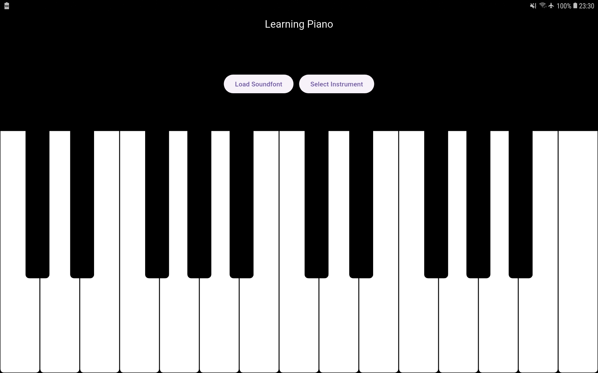

# 🎹 Learning Piano

    
    

Learning Piano è un'app Flutter di test per aiutare i bambini a imparare a suonare il pianoforte. 

 

## 🎵 Note e MIDI

Nel contesto dei valori MIDI, ogni numero intero da 0 a 127 rappresenta una specifica nota musicale. Il valore MIDI 60 corrisponde alla nota C4  (o Do4  in notazione italiana), che è il Do centrale del pianoforte standard. Nella rappresentazione della tastiera della app sono disponibili le note dal C3 al C5, inclusi i diesis e i bemolli, che hanno valori MIDI che vanno dal 48 al 72. La mappatura è fatta in questo modo:

| Ottava | Nota          | Valore MIDI |
|--------|---------------|-------------|
| 3      | C3            | 48          |
| 3      | C♯3 / D♭3     | 49          |
| 3      | D3            | 50          |
| 3      | D♯3 / E♭3     | 51          |
| 3      | E3            | 52          |
| 3      | F3            | 53          |
| 3      | F♯3 / G♭3     | 54          |
| 3      | G3            | 55          |
| 3      | G♯3 / A♭3     | 56          |
| 3      | A3            | 57          |
| 3      | A♯3 / B♭3     | 58          |
| 3      | B3            | 59          |
| 4      | C4 (Middle C) | 60          |
| 4      | C♯4 / D♭4     | 61          |
| 4      | D4            | 62          |
| 4      | D♯4 / E♭4     | 63          |
| 4      | E4            | 64          |
| 4      | F4            | 65          |
| 4      | F♯4 / G♭4     | 66          |
| 4      | G4            | 67          |
| 4      | G♯4 / A♭4     | 68          |
| 4      | A4            | 69          |
| 4      | A♯4 / B♭4     | 70          |
| 4      | B4            | 71          |
| 5      | C5            | 72          |

## 🙌 Crediti

I suoni della tastiera sono riprodotti utilizzando questa libreria: [flutter_midi_pro](https://pub.dev/packages/flutter_midi_pro) che permette di riprodurre i file SoundFont (.sf2). Il file sf2 utilizzato come esempio per il pianoforte è preso dagli asset del repo stesso: [TimGM6mb.sf2](https://github.com/Crescodev/flutter_midi_pro/blob/master/example/assets/TimGM6mb.sf2).

## 📋 Licenza

Learning Piano è rilasciato sotto la [MIT license](LICENSE.md). Puoi utilizzare il codice per qualsiasi scopo, inclusi progetti commerciali.

